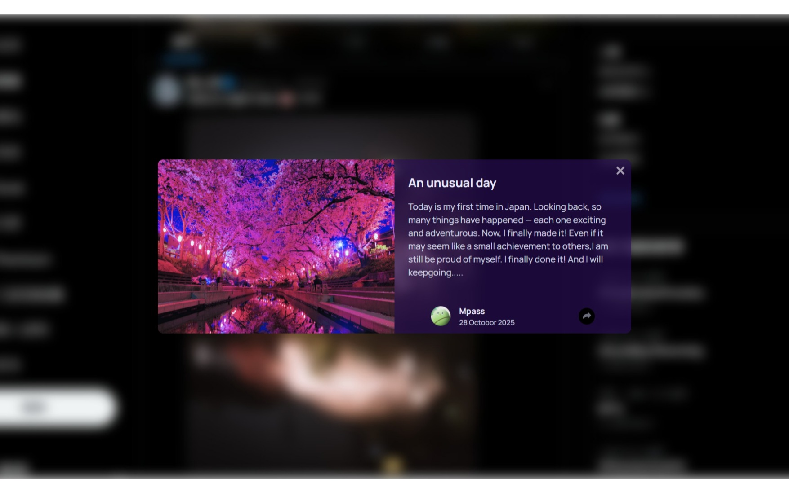

## Table of contents

- [Overview](#overview)
  - [The challenge](#the-challenge)
  - [Screenshot](#screenshot)
  - [Links](#links)
- [My process](#my-process)
  - [Built with](#built-with)
  - [What I learned](#what-i-learned)
  - [Continued development](#continued-development)
  - [Useful resources](#useful-resources)
- [Author](#author)
- [Acknowledgments](#acknowledgments)

## Overview

### The challenge

Users should be able to:

- View the optimal layout for the component depending on their device's screen size
- See the social media share links when they click the share icon
- See typing animation when first comm in to website.

### Screenshot

-layout

-active

### Links

- Solution URL: [https://github.com/Benson0721/Grid-testimonials]
- Live Site URL: [https://benson0721.github.io/Grid-testimonials/]

## My process

### Built with

- Semantic HTML5 markup
- CSS custom properties
- Flexbox
- vanilla javascript
- Scss
- Mobile-first workflow

### What I learned

This practice really reminded me that I am still an unskilled JavaScript learner! When I first saw the active animation in this exercise, I had no idea what to do. It required using the DOM concepts I had learned, but despite watching many online classes, I still have little actual practice. The biggest challenge I encountered was recalling my knowledge and applying it correctly.

### Continued development

JavaScript is the core programming language for web development, and while it is challenging, it is also fun! I can't wait to move on to the next JavaScript practice and learn new things!

## Author

- Github - [Mpass](https://github.com/Benson0721)
- Frontend Mentor - [@Mpass](https://www.frontendmentor.io/profile/Benson0721)
